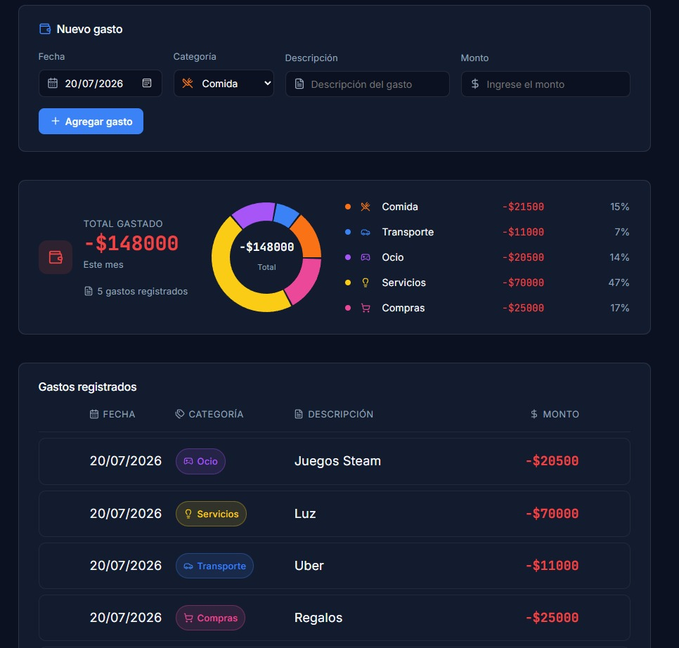
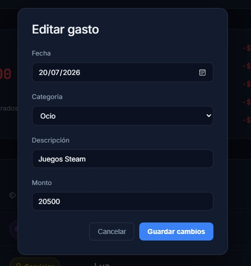

# Expense Tracker

A personal expense tracker built with React and Supabase, designed with a clean, modern dark UI inspired by Linear, Notion, and Vercel.

This project was built as a learning exercise and portfolio piece, focused on real-world patterns: CRUD operations against a live database, optimistic UI, animated interactions, and thoughtful component design — all from scratch, without relying on a UI framework.

## Features

- **Add, edit, and delete expenses**, all persisted in a Supabase (PostgreSQL) database
- **Category system** with custom colors and icons (Lucide React) for Food, Transport, Home, Leisure, Services, and Shopping
- **Summary card** with a category breakdown donut chart (Recharts), total spent, and quick stats
- **Multi-select** with bulk delete
- **Context menu** per row (Edit / Duplicate / Delete)
- **Delete confirmation modal** to prevent accidental data loss
- **Undo toast** after deleting, with a 3-second window to restore
- **Smooth enter/exit animations** for rows, using measured height transitions (no CSS hacks like `max-height` guessing)
- **Fully responsive interactions**: hover reveals, animated checkboxes, and contextual menus

## Screenshots

**Add expense form + summary**

**Edit modal**

**Delete confirmation**

**Undo toast**

## Tech Stack

- **React** (Vite)
- **Supabase** (PostgreSQL database, no auth — single-user app)
- **Recharts** for the category donut chart
- **Lucide React** for icons
- Plain CSS (no framework), using CSS variables, CSS Grid, and custom animations

## Live Demo

Not deployed yet — coming soon.

## Getting Started

1. Clone the repo:

git clone https://github.com/Tomjjkz/gestor-gastos.git
cd gestor-gastos

2. Install dependencies:

npm install

3. Create a `.env` file in the project root with your own Supabase credentials:

VITE_SUPABASE_URL=your_supabase_url
VITE_SUPABASE_ANON_KEY=your_supabase_anon_key

4. Run the dev server:

npm run dev

## Roadmap

- Search and filter by category / date range
- Monthly comparison stats (average per day, trend vs. previous month)
- Deploy to Vercel

## Author

Built by [Tomás Bruno](https://github.com/Tomjjkz).
